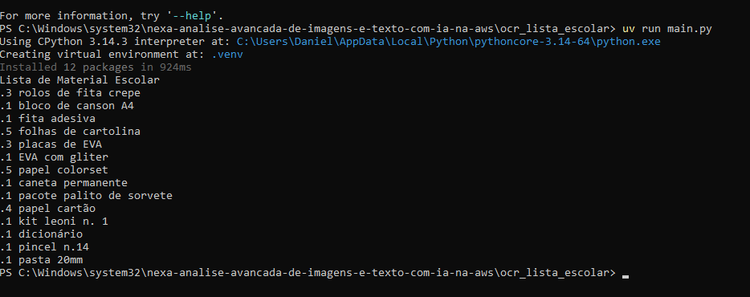

# 📝 Extração de Texto de Listas Escolares com AWS AI (OCR)

## 📖 Sobre o Projeto
Este repositório contém a entrega do projeto prático de Análise Avançada de Imagens e Texto com IA na AWS, promovido pela DIO em parceria com a Nexa. O objetivo principal deste laboratório foi explorar e utilizar serviços de Inteligência Artificial da AWS para realizar o Reconhecimento Óptico de Caracteres (OCR) em imagens de listas de material escolar.

Como estudante de Análise e Desenvolvimento de Sistemas, compreender a aplicação de IA em serviços de nuvem é fundamental para construir soluções modernas que automatizam processos manuais e repetitivos.

## 🚀 O Processo
Para chegar ao resultado esperado, o projeto foi dividido nas seguintes etapas:
1. **Configuração:** Acesso ao console da AWS, criação de usuário no IAM e configuração de credenciais de segurança via AWS CLI local.
2. **Preparação do Ambiente:** Utilização do gerenciador `uv` para criar o ambiente virtual e instalar as dependências em Python, como o `boto3`.
3. **Execução:** Submissão da imagem contendo a lista de materiais escolares ao serviço Amazon Textract através do script de execução.
4. **Extração e Validação:** Análise do retorno gerado pela IA, onde o texto da imagem foi transcrito com precisão para o terminal.

## 📸 Resultados

**Resultado da Extração (Terminal):**

## 🧠 Insights e Possibilidades
Durante o desenvolvimento e execução deste projeto, foi possível observar o poder do ecossistema de Inteligência Artificial da AWS:

* **Insights:** A precisão da ferramenta ao lidar com diferentes formatações e espaçamentos impressiona. É notável como a nuvem abstrai a complexidade do treinamento de modelos de *machine learning*, entregando uma API pronta para uso que converte imagens em dados estruturados de forma extremamente rápida.
* **Possibilidades Futuras:** Pensando em evolução técnica, essa mesma lógica poderia ser expandida através de um script em Python. Poderíamos pegar o texto extraído da lista e automatizar uma busca nos sites de e-commerce para calcular o menor preço total dos materiais. Além disso, unindo com minha experiência profissional em moderação de conteúdo, vejo que esses mesmos serviços de OCR e IA poderiam ser configurados para analisar imagens anexadas em plataformas, identificando automaticamente textos ou termos inadequados antes mesmo de passarem por uma revisão humana.

## 👨‍💻 Autor

**Daniel dos Santos Bonilho Passiani**  
*Estudante de Análise e Desenvolvimento de Sistemas*
